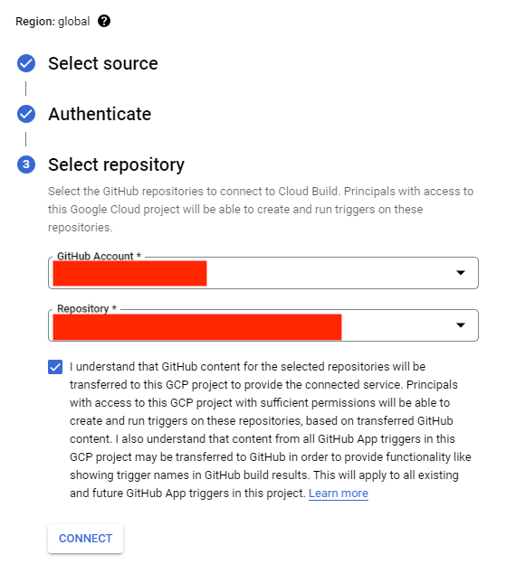

# Deploying EDP Moodle Connector

This document describes the process of deploying and configuring **EDP's Moodle Connector**. At the end, it will enable a parametrized way to ingest data (what makes sense only) from Moodle's database. This connector leverages [Dataflow](https://cloud.google.com/dataflow) under-the-hood. 

## 1. Configure Cloud Build Trigger

After provisioning infrastructure for the data platform through [EDP's foundation](https://github.com/GoogleCloudPlatform/education-data-platform/tree/main/1-foundations), make sure to create the following two triggers in Cloud Build to deploy Moodle connector artifacts.

### Trigger for Load Project

1. On the "Select from" drop-down list at the top of the page, select your Load Project: **{your-prefix}-lod**.

  

2. Once in the project context, go to the Cloud Build Triggers

  

3. Select the option **CREATE TRIGGER**

  

4. Give a name to the trigger and select the option for trigger invokation

  

5. On 'Source' click on the Repository Box and select the option **CONNECT NEW REPOSITORY**

<p align="left">
    
</p>

6. On "Select Source" select "GitHub" and click on Continue

  

7. Authenticate on the selected source, then select the Repository created on GitHub for EDP, check the box accepting the conditions, and click in **CONNECT**

  

8. Add the filter so the build are going to be triggered only when changes are pushed to Moodle connector folders (Files, temp and JDBC)

  

9. On Configuration select the option **Cloud Build configguration file (yaml or json)** and inform the relational path to the build file

  

10. On Advanced select the option **ADD VARIABLE** and create the following variable with the name of the Load Cloud Storage Bucket:

| Variables             | Example value           | Description             |
|-----------------------|-------------------------|-------------------------|
| _DATAFLOW_LOAD_BUCKET | {your-prefix}-load-cs-0 | Name of the Load Bucket |

<p align="left">
    
</p>

11. Click on **CREATE**

### Trigger for Orchestration Project

1. On the "Select from" drop-down list at the top of the page, select your Orchestration Project: **{your-prefix}-orc**.

  

2. Once in the project context, go to the Cloud Build Triggers

  

3. Select the option **CREATE TRIGGER**

  

4. Give a name to the trigger and select the option for trigger invokation

  

5. On 'Source' click on the Repository Box and select the option **CONNECT NEW REPOSITORY**

<p align="left">
    
</p>

6. On "Select Source" select "GitHub" and click on Continue

  

7. Authenticate on the selected source, then select the Repository created on GitHub for EDP, check the box accepting the conditions, and click in **CONNECT**

  

8. Add the filter so the build are going to be triggered only when changes are pushed to Orchestrations folders for Moodle connector (dags and data)

  

9. On Configuration select the option **Cloud Build configguration file (yaml or json)** and inform the relational path to the build file

  

10. Refer to {your-prefix}-orc project to find the bucket name for composer artifacts (name pattern: "{your-gcp-region}-{your-prefix}-orc-cmp-0-{random-id}-bucket"). On Advanced session select the option **ADD VARIABLE** and create the following variable with the name of the Composer Cloud Storage Bucket:

```tfvars
_DATAFLOW_COMPOSER_BUCKET = "{your-gcp-region}-{your-prefix}-orc-cmp-0-{random-id}-bucket"
```

  

11. Click on **CREATE**


## 2. Configure Moodle Connector variables

Before deploying the Moodle Connector's artifacts, you need to configure the [Files/config_files/config.json](Files/config_files/config.json) by filling in the following sets of variables:

- **"project_id": "{your-prefix}-lod"** = Load project in EDP
- **"project_id_bq": "{your-prefix}-dwh-lnd"** = Data Warehouse project for landing raw data
- **"prj_id_bq_cur": "{your-prefix}-dwh-cur"** = Data Warehouse project for curated data
- **"dataset_name": "your-moodle-raw-database-name"** = BigQuery dataset name to load raw data in the landing project ({your-prefix}-dwh-lnd)
- **"dts_nm_cur": "your-moodle-curated-database-name"** = BigQuery dataset name to load enriched data in the curated project ({your-prefix}-dwh-cur)
- **"region": "your-gcp-region"** = The region in which you are creating the Google Cloud resources
- **"conn_url":"jdbc:mysql://{your-moodle-database-server-ip}/{your-database-name}"** = Connection URL for Moodle repository
- **"conn_user": "your-moodle-database-user"** = Username to connect to your Moodle database
- **"conn_pass": "your-moodle-database-password"** = Password to connect to your Moodle database
- **"bq_sa_email": "{your-prefix}-load-df-0@{your-prefix}-lod.iam.gserviceaccount.com"** = Service account to load data into BigQuery
- **"dir_schm": "gs://{your-prefix}-load-cs-0/Files/config_files/mdl_schemas.tar.gz"** = Bucket path in which it will be stored the Moodle tables schemas definition for BigQuery landing zone
- **"dir_views_cur": "gs://{your-prefix}-load-cs-0/Files/config_files/mdl_views_cur.tar.gz"** = Bucket path in which it will be stored the views code for the curated layer
- **"tables"** = List of table to be ingested from Moodle to EDP. For the complete list of tables available refer to Moodle 4.0 [documentation](https://www.examulator.com/er/4.0/). 

You can keep the default values for the following variables or customize them according to your needs:

- **url_template** = The Dataflow template URL
- **driver_jar** = Path where the .jar file is stored for the JDBC connection
- **driverclsname** = Class name of the Driver
- **bq_temp_dir** = Temporary directory required for Dataflow
- **retention_data** = Time in seconds for the table partition data retention
- **max_df_instance** = The maximum number of Dataflow jobs running in parallel to ingest Moodle data 

As soon as you push the changes of these variables to your EDP repository in GitHub, the trigger configured in Cloud Build for Load Pipeline is going to run and deploy all the artifacts needed to run the Moodle connector pipelines.

At this point, there is no changes to apply in the orchestration artifacts. So, to deploy them you must run the trigger created on Orchestration project manually. However, anytime changes for Orchestration artifacts are pushed in the EDP Repo, Cloud Build in the orc project is going to be triggerd automatically. 
