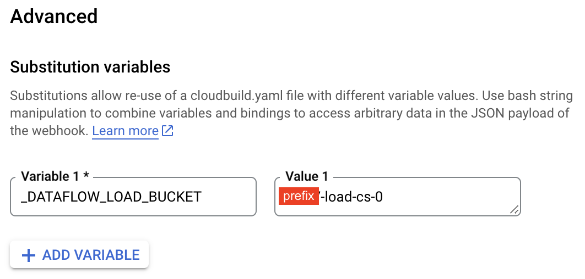
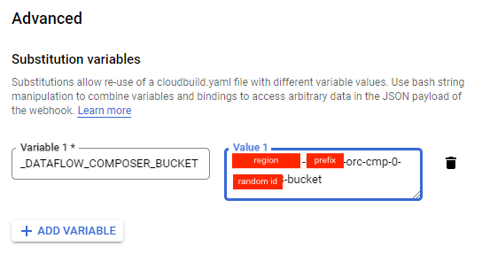

# Creating the deployment for Composer Education for Data Platform Foundation

This document describes the process of deploying and configuring **EDP's Moodle Connector**. At the end, it will allow a parametrized way to ingest data (what makes sense only) from Moodle's database. This connector leverages [Dataflow](https://cloud.google.com/dataflow) under-the-hood. 

## Configure Cloud Build Trigger

After provisioning infrastructure for data through [EDP's foundation](https://github.com/GoogleCloudPlatform/education-data-platform/tree/main/1-foundations), make sure to set up the following values in "Files/config-file":

- The Load Bucket ID **{your-prefix}-lod-cs-0**
- The Composer Bucket ID **{your-gcp-region}-{your-prefix}-orc-cmp-0-834e7303-bucket**

With those informations you need to create two triggers in Cloud Build

### Trigger for Load Bucket

1. First you select the Load Project: **{your-prefix}-lod**.

  

2. Once in the project context, go to the Cloud Build Triggers

  

3. Select the option **CREATE TRIGGER**

  

4. Give a name to the trigger and select the option for trigger invokation

  

5. On 'Source' click on the Repository Box and select the option **CONNECT NEW REPOSITORY**

  

6. Select the Service Source and click on Continue

  

7. Authenticate on the Service Source, select the Repository, check the box accepting the conditions and click in **CONNECT**

  

8. Add the filter to trigger the build modifications only in the folders for Load Bucket (Files, temp and JDBC)

  

9. On Configuration select the option **Cloud Build configguration file (yaml or json)** and inform the relational path to the build file

  

10. On Advanced select the option **ADD VARIABLE** and create the following variable with the name of Load Cloud Storage

| Variables             | Example value   | Description             |
|-----------------------|-----------------|-------------------------|
| _DATAFLOW_LOAD_BUCKET | {your-prefix}-lod-cs-0 | Name of the Load Bucket |

  

11. Click on **CREATE**

### Trigger for Composer Bucket

1. First you select the Ochestration Project (**{your-prefix}-orc**)

  

2. Once in the project context, go to the Cloud Build Triggers

  

3. Select the option **CREATE TRIGGER**

  

4. Give a name to the trigger and select the option for trigger invokation

  

5. On 'Source' click on the Repository Box and select the option **CONNECT NEW REPOSITORY**

  

6. Select the Service Source and click on Continue

  

7. Authenticate on the Service Source, select the Repository, check the box accepting the conditions and click in **CONNECT**

  

8. Add the filter to trigger the build modifications only in the folders for Composer Bucket (dags and data)

  

9. On Configuration select the option **Cloud Build configguration file (yaml or json)** and inform the relational path to the build file

  

10. On Advanced select the option **ADD VARIABLE** and create the following variable with the name of Composer Cloud Storage

```tfvars
_DATAFLOW_COMPOSER_BUCKET = "{your-gcp-region}-{your-prefix}-orc-cmp-0-834e7303-bucket"
```

  

11. Click on **CREATE**

## How to run

First you need to configure the config.json according to your parameters, the file is located on PREFIX-load-cs-0/ Files/config_files/config.json

You will need to setup all the variables according to your project before running the pipelines

All the necessary files will be load automatically on composer using the cloud build

The templates for Cloud Build are located [here](./cloud-build/)

## Cloud Composer

The Cloud Composer will be used as a orchestration solution of ingestion pipelines of data froam moodle database and API execution pipeline, besides other two process auxiliary DAG's.

In this project we have the following pipelines:

- moodle_pipeline
- create_table_bq
- create_views_cur

## moodle_pipeline

This DAG solution consists of gathering data from Moodle database (MySQL) and record in Google Cloud BigQuery.

For this is used the following GCP Cloud resources:

- Cloud Storage
- Cloud Dataflow
- Cloud Composer

The functionality begins from the JAR file, responsible for the JDBC connection with the Moodle Database (MySQL), is stored in the Load bucket

The DAG is responsible for the moodle pipeline execution, executing the DataFlow Job for each table listed in the configuration file. The pipeline will establish the connection with the Moodle Database, run a SELECT on the informed table and write the data on Cloud BigQuery.

The Moodle Pipeline is parametrized with variables stored in the .json config file - config.json stored on the Load Bucket on Files/config_files tree. This file bring flexibility to configure and execute Cloud DataFlow.

The Mooddle Pipeline has a dynamic max tables load (Jobs DataFlow), to avoid overload the CPU quota form Cloud DataFlow machines and preventing errors.

As the Load Jobs finish, the new Jobs (loads from other tables) are initialized, until all tables listed are processed.

To use the moodle_pipeline, update the configuration file (config.json) in the Load Bucket ID (PREFIX-load-cs-0), folder Files/config_files - in the GCP environment.

The following variables must be informed for the correct execution of this pipeline:

- **project_id** =  Id of load project used to load data from the drop off zone (or source databases) to the data warehouse  ({your-prefix}-lod)
- **project_id_bq** =  Id of project that contains the BigQuery tables - Landing Raw Data ({your-prefix}-dwh-lnd)
- **prj_id_bq_cur** = Id of project that contains the BigQuery tables/views in the Curated layer ({your-prefix}-dwh-cur)
- **dataset_name** = Name of the dataset where the moodle tables will be stored in the landing Layer ({your-prefix}_dwh_lnd_bq_0)
- **dts_nm_cur** = Name of the dataset where the moodle tables/views will be stored in the curated Layer
- **region** = Cloud region where the resource will be executed
- **url_template** = The Dataflow template URL
- **driver_jar** = Path where the .jar file is stored for the JDBC connection
- **driverclsname** = Class name of the Driver
- **conn_url** = URL address for connection with the Moodle Database
- **conn_user** = User for Moodle Database connection
- **conn_pass** = Password for Moodle Database connection
- **bq_temp_dir** = Temporary directory required for Dataflow
- **bq_sa_email** = Service account e-mail used by Dataflow
- **retention_data** = Time in seconds for the table partition data retention
- **max_df_instance** = The maximun number of instances to parallel execution of Dataflow
- **dir_schm** = Path on bucket where it will be stored the tables schemas of BigQuery
- **dir_views_cur** = Path on bucket where it will be stored the select of views that will be created in the curated layer
- **tables** = Table names to be processed

## create_table_bq

This DAG create all tables of Moodle in BigQuery.

This process execution use the configurations listed on Dataflow/BigQuery config File to create the datase and tables - project_id_qa, dataset_name and retention_data

To create the tables, the process uses the table's schema in Json format (same pattern/structure as in bigquery).

This framework already contains all table schemas of moodle version 4 (469 tables) and are available in the filemdl_schemas.tar.gz

The schema files must have the following name pattern: 

```
schema.{moodle-table-name}.json
```

The structure of the mdl_schemas.tar.gz file must be:

```
mdl_schemas
   | schema.tabela1.json
   | Schema.tabela2.json
   | Schema.tabela3.json
  ...
```  

This DAG must be executed manualy before the execution of moodle_pipeline DAG, to create the datase/tables used by it.

## create_views_cur

This DAG is responsible for creating the Bigquery Views in the Data Warehouse project, Curated Layer.

This process execution use the configurations listed on Dataflow/BigQuery config File to create the Dataset - if necessary - and the views – project_id_bq, dataset_name, dir_views_cur, prj_id_bq_cur and dts_nm_cur

It is necessary to create a .sql file with the select of each view, separately.

In the View select, when informing the project_id.dataset_name.table_name, the following pattern below must be used, so that the process can create the view correctly.

Exemple:

```sql
select * from [prj_id_lnd].[dts_nm_lnd].mdl_course
```

It is important to know that the name of the view will be created according to the name of the .sql file

If the file name is v_mdl_course.sql, the view name will be v_mdl_course

The view(s) will be created in the project/dataset according to the prj_id_bq_cur and dts_nm_cur parameters.

The views must be in a file named mdl_views_cur.tar.gz

The structure of the mdl_views_cur.tar.gz file must be:

```
mdl_views_cur
  | v_mdl_courses.sql
  | v_mdl_grades.sql
  | v_mdl_users.sql
  ...
```

The file mdl_views_cur.tar.gz must be available in the bucket/folder where the Dataflow/BigQuery configuration files are located.
