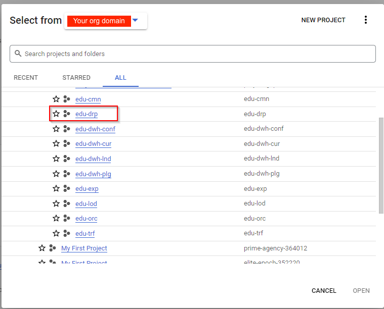
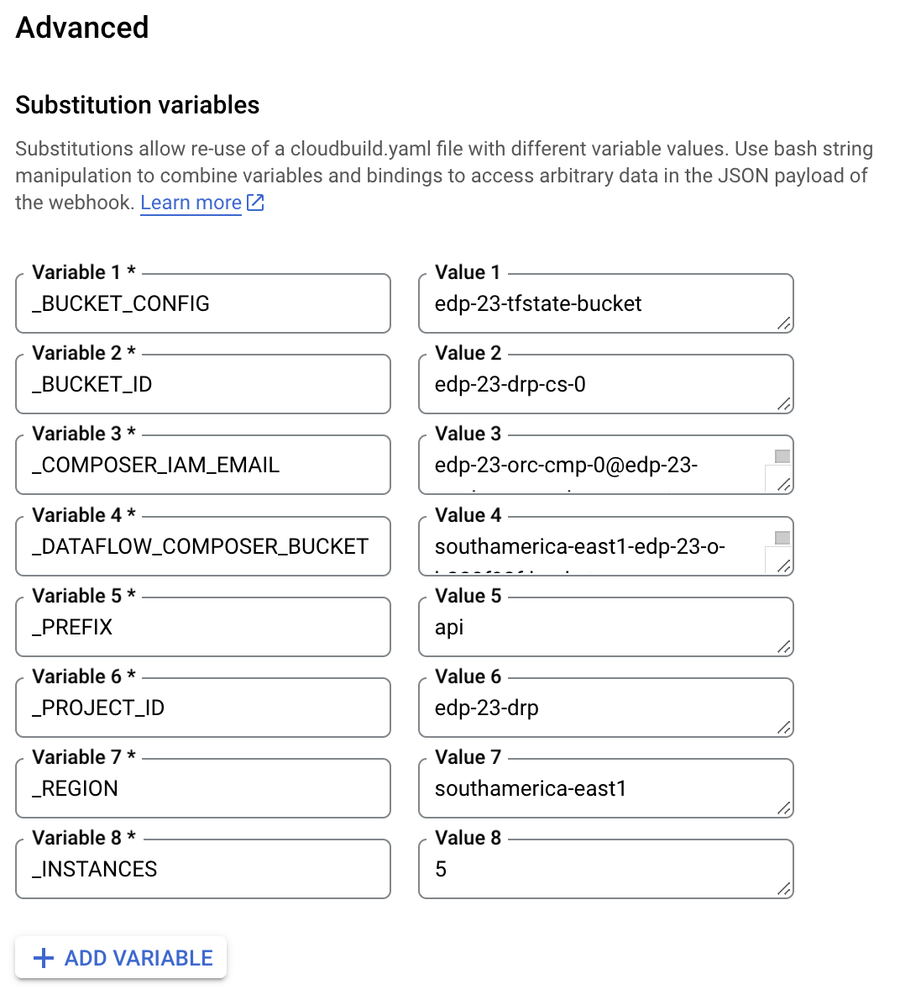
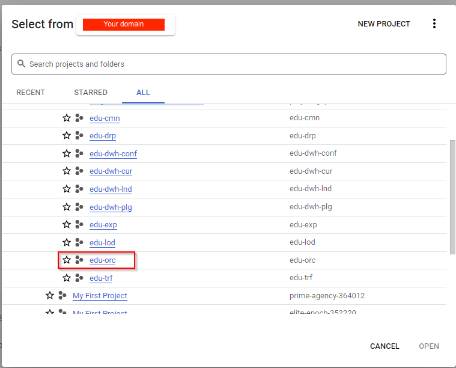

# Creating the deployment for API Education for Data Platform Foundation

This tutorial shows you how to configure the Cloud Build to deploy the API Education over the Data Platform Foundation.

The following diagram is a high-level reference of the resources created and managed here:

After you provision the [Data Platform Foundation](https://github.com/GoogleCloudPlatform/cloud-foundation-fabric/tree/master/blueprints/data-solutions/data-platform-foundations) you need to [create a Cloud Storage in GCP](https://cloud.google.com/storage/docs/creating-buckets), inside the project of Dropoff, to store the Terraform state file and the following values

- Name of the Dropoff Bucket ID **PREFIX-drp-cs-0**
- Service Account Email of Orchestrator Composer **PREFIX-orc-cmp-0@PREFIX-orc.iam.gserviceaccount.com**
- Project ID of the Dropoff Project **PREFIX-drp**
- Region of where the project was created
- The endpoint name for the API for the variable **_PREFIX**
- Permission of 'Storage Object Creator' for Dropoff Cloud Build Service Account on the Orchestration Project (**PREFIX-orc**)

With those informations you need to create a trigger

## Trigger for Education API

1. First you select the Dropoff Project (**PREFIX-drp**)

  

2. Once in the project context, go to the Cloud Build Triggers

  

3. Select the option **CREATE TRIGGER**

  

4. Give a name to the trigger and select the option for trigger invokation

  

5. On 'Source' click on the Repository Box and select the option **CONNECT NEW REPOSITORY**

  

6. Select the Service Source and click on Continue

  

7. Authenticate on the Service Source, select the Repository, check the box accepting the conditions and click in **CONNECT**

  

8. Add the filter to trigger the build modifications only in the folders for API Pipeline Bucket

  

9. On Configuration select the option **Cloud Build configguration file (yaml or json)** and inform the relational path to the build file

  

10. On Advanced select the option **ADD VARIABLE** and create the following variable with the name of Load Cloud Storage

| Variables                 | Example value                                       | Description                              |
|---------------------------|-----------------------------------------------------|------------------------------------------|
| _BUCKET_CONFIG            | tfstate-bucket                                      | Bucket Name for Terraform tfstate        |
| _BUCKET_ID                | PREFIX-drp-cs-0                                     | Bucket Name of Dropoff environment       |
| _COMPOSER_IAM_EMAIL       | PREFIX-orc-cmp-0@PREFIX-orc.iam.gserviceaccount.com | Composer Service Account email           |
| _DATAFLOW_COMPOSER_BUCKET | europe-west1-PREFIX-orc-cmp-0-834e7303-bucket       | Name of Composer Bucket                  |
| _PREFIX                   | api                                                 | Name of the folder for Terraform tfstate |
| _PROJECT_ID               | PREFIX-drp                                          | Name of the Dropoff project              |
| _REGION                   | europe-west1                                        | Region of the deploy                     |

  

11. Click on **CREATE**

12. Go to Cloud Build Settings and get the Cloud Build Service Account email

  

13. Go to Orchestration Project

  

14. Select IAM & Admin

  

15.  Click in **GRANT ACCESS** inform the Service Account email in 'New principals' and select the Role '**Storage Admin(roles/storage.Admin)**', '**Cloud Functions Admin(roles/cloudfunctions.admin)**', '**Security Admin(roles/iam.securityAdmin)**', '**Create Service Account(roles/iam.serviceAccounts.create)**' and '**Service Account User(roles/iamserviceAccountUser)**'

  

  

The templates for Cloud Build are located [here](./cloud-build/)

## How to run

First you need to configure the config.json according to your parameters, the file is located on PREFIX-drp-cs-0/config/config.json

You will need to setup all the variables according to your project before running the pipelines

All the necessary files will be load automatically on composer using the cloud build

The templates for Cloud Build are located [here](./cloud-build/)

## Cloud Function (API)

The API is proposed to consume other APIs and generate files (JSON or CSV) inside a bucket, in the GCP environment.
The API was built using a cloud function and its use is very flexible, allowing the consumption of several different endpoints in the same processing.

To use the function, update the configuration file (config.json) in the Dropoff Bucket (PREFIX-drp-cs-0), folder config - in the GCP environment with the following parameters:

- "project_id": "Project ID of the Dropoff Project PREFIX-drp";
- "bucket": "Name of the Dropoff Bucket ID PREFIX-drp-cs-0 that contains the configuration file with the name config.json";
- "api_path": "Folder name where the function will save the returned APIs consumed in JSON or CSV format;
- "api_uri": "http or https address of the function (trigger)";
- "endpoints": "List of objects containing the necessary information for the correct functioning of the function";

Within the list of endpoints, it is necessary to assemble objects with the following structure:

- "url": "API / Endpoint address to be consumed";
- "type": "Output file format (JSON or CSV)";
- "blob": "Path inside the bucket to generate the files (by default use a name of your choice plus '/load' for correct integration with the bigquery load routines"; The name of the folder where the file is stored will be the name of the BigQuery table
- "project_id_bq": "Id of project that contains the BigQuery tables - Landing Raw Data (PREFIX-dwh-lnd)"
- "dataset_name": "Name of the dataset where the moodle tables will be stored in the Landing Raw Data (PREFIX-dwh-lnd)"
- "retention_data": "Time in seconds for the table partition data retention"

## Cloud Composer

The Cloud Composer will be used as a orchestration solution of ingestion pipelines of data from API execution pipeline, besides other process auxiliary DAG's.

In this project we have the following pipelines:

- API_pipeline
- bq_load
