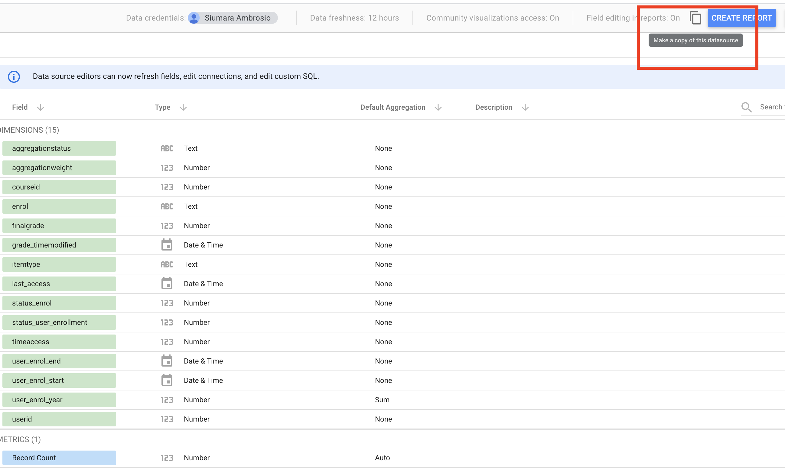
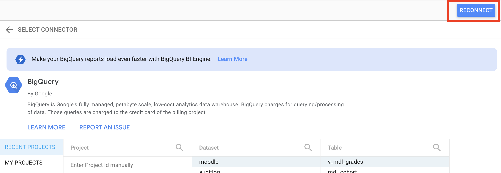

# Students and Courses Dashboards

This view illustrates how you can leverage data ingested in the Education Data Platform to understand your student's performance and enrollment metrics. You can use this dashboard as-is, or use it as a starting point for more complex visualizations.

The dashboard is comprised of the following reports:

1. [Students Overview](students-overview-dashboard.md)
2. Students Performance Prediction (coming soon)
3. Enrollment Prediction (coming soon)

The above links will direct you to documentation for each individual report which will describe its contents in more detail.

The following steps describe how to make a copy of these dashboards and the underlying data sources for use as-is.

## Prerequisites

In order to create the dashboard and query the Education Data Platform tables a user must:

1. Deploy the steps [1-foundations](../../1-foundations/README.md) and [2-connector-moodle](../../2-connector-moodle/README.md) of this repository;
2. Run the dags create_tables_bq, create_views_cur, and moodle_pipeline so the Moodle tables are going to be created and ingested with data from a Moodle source repository, and the views on the curated layer are going to provide an integrated view of students, courses, and grades;
3. Add dashboard users into the Data Analysts group (default value = gcp_data_analysts) so they can access the following views:
   - `{PREFIX}-dwh-cur.{BQ_DATASETNAME}.v_mdl_courses`
   - `{PREFIX}-dwh-cur.{BQ_DATASETNAME}.v_mdl_users`
   - `{PREFIX}-dwh-cur.{BQ_DATASETNAME}.v_mdl_grades`
       
   Note: $PREFIX and $BQ_DATASETNAME are variables set during the deploy of the steps 1 and 2 and they mean respectively the prefix used to create the projects for the data platform foundations and the name of the dataset created in BigQuery to ingest Moodle data.

The pre-built dashboards in this repository are public but you can modify permissions according to your institution needs. More information about data credentials in Data Studio can be found [here](https://support.google.com/looker-studio/answer/6371135#zippy=%2Cin-this-article). 

## 1. Data Sources

Log in to Data Studio and copy the following data sources: 

1. [v_mdl_courses](https://lookerstudio.google.com/datasources/e843f7c1-1ef8-4a03-bbad-045c7340b094)
2. [v_mdl_grades](https://lookerstudio.google.com/datasources/20b6068d-215e-464e-9994-6708dce6f865)
3. [v_mdl_users](https://lookerstudio.google.com/datasources/63bddbc1-896e-42f7-a1fc-013934953452)

Click on "Make a copy of this datasource" to create your local copy.

    

After selecting your curated layer project ({PREFIX}-dwh-cur),the BigQuery dataset name you configured during the Moodle Connector deploy, and the view, click on RECONNECT to create the data source in you account.

    

Then you must rename your data source to remove the prefix "Copy of ".

More information on copying data sources can be found [here](https://support.google.com/looker-studio/answer/7421646?hl=en&ref_topic=6370331#zippy=%2Cin-this-article).

## 2. Dashboard

Create a copy of the [public](https://lookerstudio.google.com/reporting/5d8ad73e-f625-4d69-b3fc-c527315779cc) dashboard. You will be asked to choose a new data source for each data source in the report. 
Select the appropriate data sources from the ones you created in step 1 in the following order:

1. v_mdl_courses
2. v_mdl_grades
3. v_mdl_users

Click on Copy Report and rename it as desired. You can find more details about copying reports on Looker Studio [here](https://support.google.com/looker-studio/answer/7175478?hl=en#zippy=%2Cin-this-article).