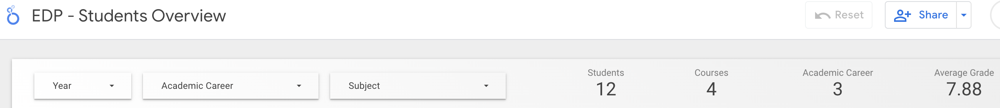

# Students Overview

The Students Overview Report gives an overview of an education institution’s students and courses performance measured in years.

The current dashboard version contains data from Moodle 4.0. However, integration with other educational systems is coming soon.

## Filter Bar & Scorecards

This report allows users to filter data by year, academic career, or subject. When a filter is applied, all charts and scorecards on the page will be updated to use those filters. Dashboard owners and editors can define a default year range that is most suitable for their use case.

Alongside the filters are several scorecards that provide general statistics including total students in the source repository, total courses, total academic careers, and general students' average grade. 

    

## How many students per course?

This graph displays how many students are enrolled in the courses, sorted by the courses with more students enrolled.

    

## Which subjects are driving enrollment?

This chart displays which subject areas are engaging more students enrollment.

    

## What is the average grade by course?

This graph shows what is the general students' average grade by the courses they are enrolled.

    

## Student Details

This table displays details about the students. In this section of the dashboard, users can filter the results by course, and students' first and last names. 

    

## Student Distribution

These graphs displays how the students are distributed among the academic careers and the students' general average grades. The filters mentioned on the Student Details section are also applied to this section.

    

