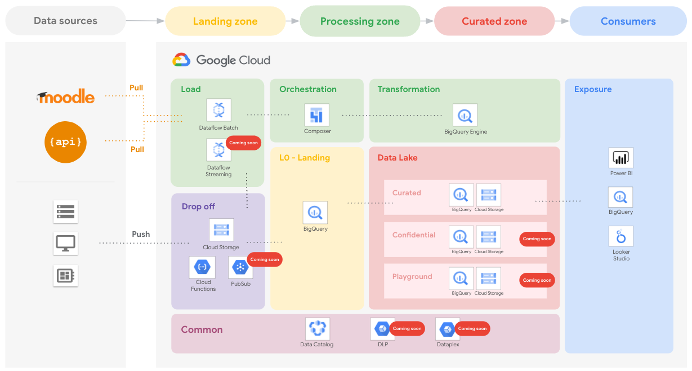

# Education Data Platform (EDP)

This repository provides a reference architecture followed by **end-to-end blueprints**, scripts and a **suite of Terraform modules** for Google Cloud Platform (GCP), designed to automate the creation, governance and observability of a modern and robust data repository for educational institutions, looking into becoming a data-driven organization and so adhering digital education.

    

Some key differentiators of this approach are:

- Organization-wide [landing zone](1-foundations/README.md) used to bootstrap the deployment of data foundations, the actual infrastructure (BigQuery-based) in which the whole organization's data (structured and unstructured) will be sitting.
- Acceleration and automation of data ingestion through built-in [connectors (Composer pipelines)](docs/edp-concepts.md) to some of the most popular educational tools in the market, with Moodle being one of them.
- Acceleration and automation of data ingestion from Restful Open APIs via built-in [connectors (Cloud Functions)](docs/edp-concepts.md).
- Easily customizable via lean [Terraform modules](modules/README.md).
- Ran in a scenario where only pieces of it would be suitable? No problem. You can pick and choose whatever bits work best for you.

> **Important:** The whole repository is meant to be cloned as a single unit to seed production usage.

## Documentation (more coming soon)

1. [EDP's concepts](docs/edp-concepts.md)
2. [Architecture and components](docs/edp-architecture.md)
3. Pre-requisites for deploying EDP
4. Deploying EDP's infrastructure
5. Deploying connectors
   1. Connector for Moodle
   2. Connector for Open APIs
6. How to use it
   1. Ingesting Moodle's data
   2. Ingesting Open API's data
   3. Curating data
   4. [Exposing data to external consumption](4-looker-dashboards/moodle-students-overview.md)
