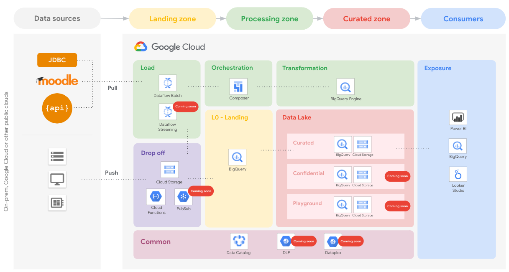

# Education Data Platform (EDP) architecture and components

This module implements an opinionated Data Platform Architecture that creates and setup projects and related resources that compose an end-to-end data environment.

The code is intentionally simple, as it's intended to provide a generic initial setup and then allow easy customizations to complete the implementation of the intended design.

The following diagram is a high-level reference of the resources created and managed here:

    

A demo Airflow pipeline is also part of this blueprint: it can be built and run on top of the foundational infrastructure to verify or test the setup quickly.

## Design overview and choices

Despite its simplicity, this stage implements the basics of a design that we've seen working well for various customers.

The approach adapts to different high-level requirements:

- boundaries for each step
- clearly defined actors
- least privilege principle
- rely on service account impersonation

The code in this blueprint doesn't address Organization-level configurations (Organization policy, VPC-SC, centralized logs). We expect those elements to be managed by automation stages external to this script like those in [FAST](../fast).

### Project structure

The Data Platform is designed to rely on several projects, one project per data stage. The stages identified are:

- drop off
- load
- data warehouse
- orchestration
- transformation
- exposure
- common

This separation into projects allows adhering to the least-privilege principle by using project-level roles.

The script will create the following projects:

- **Drop off**. Used to store temporary data. Data is pushed to Cloud Storage, BigQuery, or Cloud PubSub. Resources are configured with a customizable lifecycle policy.
- **Load**. Used to load data from the drop-off zone to the data warehouse. The load is made with minimal to zero transformation logic (mainly `cast`). Anonymization or tokenization of Personally Identifiable Information (PII) can be implemented here or in the transformation stage, depending on your requirements. The use of [Cloud Dataflow templates](https://cloud.google.com/dataflow/docs/concepts/dataflow-templates) is recommended.
- **Data Warehouse**. Several projects distributed across 3 separate layers, to host progressively processed and refined data:
  - **Landing - Raw data**. Structured Data, stored in relevant formats: structured data stored in BigQuery, unstructured data stored on Cloud Storage with additional metadata stored in BigQuery (for example pictures stored in Cloud Storage and analysis of the images for Cloud Vision API stored in BigQuery).
  - **Curated**. Cleansed, aggregated and curated data.
  - **Confidential**. Curated and unencrypted layer.
  - **Playground**. Temporary tables that Data Analysts may use to perform R&D on data available in other Data Warehouse layers.
- **Orchestration**. Used to host Cloud Composer, which orchestrates all tasks that move data across layers.
- **Transformation**. Used to move data between Data Warehouse layers. We strongly suggest relying on BigQuery Engine to perform the transformations. If BigQuery doesn't have the features needed to perform your transformations, you can use Cloud Dataflow with [Cloud Dataflow templates](https://cloud.google.com/dataflow/docs/concepts/dataflow-templates). This stage can also optionally anonymize or tokenize PII.
- **Exposure**. Used to host resources that share processed data with external systems. Depending on the access pattern, data can be presented via Cloud SQL, BigQuery, or Bigtable. For BigQuery data, we strongly suggest relying on [Authorized views](https://cloud.google.com/bigquery/docs/authorized-views).
- **Common**. is a governance layer that allows components to share resources across the entire platform, like Data Catalog, DLP and others.